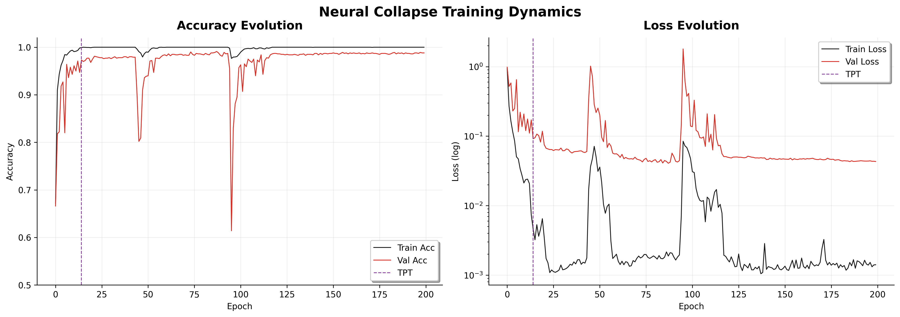
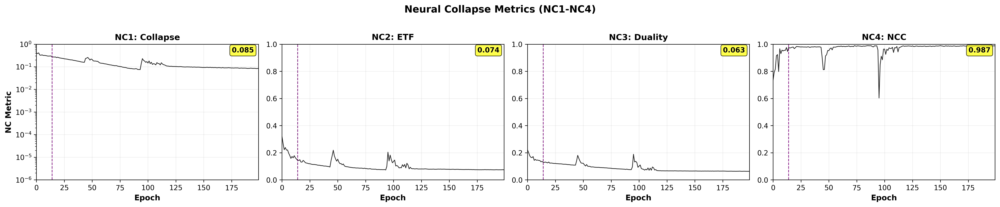

# Neural collapse in CNN-1D

Laboratory repository for the Quantitative Evaluation of Neural Networks, focused on Neural Collapse, designed to emulate the following article:
  

>Papyan, V., Han, X., & Donoho, D. L. (2020). Neural Collapse. Proceedings of the International Conference on Learning Representations (ICLR). https://arxiv.org/abs/2004.00473


The objective of this project is not merely to observe Neural Collapse but to explore its emergence through ablation studies and layer-wise analysis. 
By varying optimization methods and training regimes, we investigate which components of the learning dynamics are necessary and sufficient for the Neural Collaps regime to appear and how it progressiely forms across network layers.


>Zhu, Z., Ding, T., Zhou, J., Li, X., You, C., Sulam, J., & Qu, Q. (2021).  *A Geometric Analysis of Neural Collapse with Unconstrained Features*. International Conference on Learning Representations (ICLR).


This project enables controlled experiments to answer:

- *Which layers collapse first?*
- *Is ETF geometry present in early representations or only at the penultimate layer?*
- *How do different optimizers alter the collapse dynamics?*

<details> <summary>How to run the project?</summary>

Prerequisites:
```
pip install -r requirements.txt
```
Let's run Neural Collapse experiment :

```
python main_nc.py
```
> Please, always check if the configuration file it's correct
</details>

 🧪 Experiment 1 — Baseline Neural Collapse with SGD

As a first experiment, we reproduce the **canonical Neural Collapse setting** described by Papyan et al. (2020) by training a **CNN-1D on MNIST-1D using standard SGD** for a sufficiently long horizon (200 epochs).
The goal of this experiment is to establish a **reference collapse trajectory** in which:
- training reaches the **interpolation regime**,
- the **Training Phase Transition (TPT)** is crossed,
- and the network converges toward the **Neural Collapse fixed point**.

During training we track the four core Neural Collapse metrics:


| Metric | Interpretation |
|--------|----------------|
| **NC1** | Within-class feature collapse |
| **NC2** | ETF structure of class means |
| **NC3** | Duality between classifier weights and class centroids |
| **NC4** | Nearest Class Center optimality |

<details> 
<summary> 🏗 Model Architecture — CNN-1D</summary>


All experiments use a fixed **CNN-1D** architecture specifically designed to expose a **high-dimensional penultimate feature space** where Neural Collapse can be measured.


```
Input (1 × 40)
   ↓
Conv1D + ReLU
(1 → 32) 
   ↓
Conv1D  + ReLU
(32 → 64)
   ↓
Conv1D  + ReLU
(64 → 128)
   ↓
Global Average Pooling
   ↓
Penultimate Layer 
(128-D feature vector)
   ↓
Linear Classifier
(128 → 10)
```
</details>
<details> <summary>Training Dynamics </summary>
<div align="center">

</div>

The dashed vertical line marks the **TPT**, after which training accuracy saturates and the loss enters a low-noise regime.  
This phase transition is where Neural Collapse is theoretically expected to begin.
</details>
<details> <summary>Neural Collapse Metrics </summary>

<div align="center">

</div>

The four Neural Collapse conditions are measured during training:
All metrics converge after the TPT, confirming that the network enters the **Neural Collapse regime** predicted by theory.
</details>


