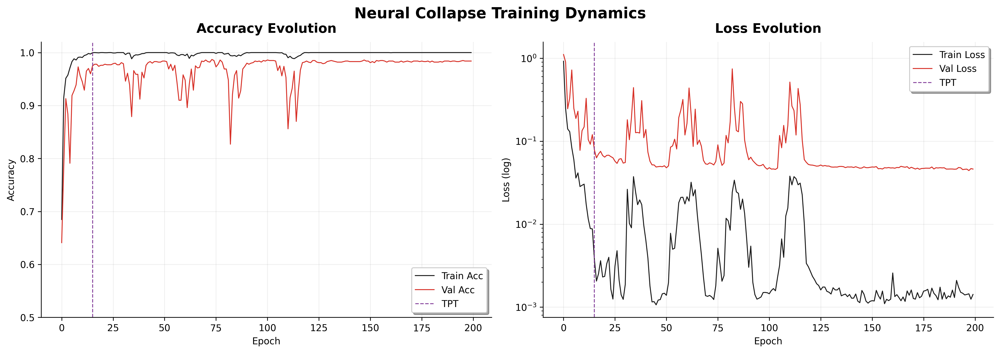
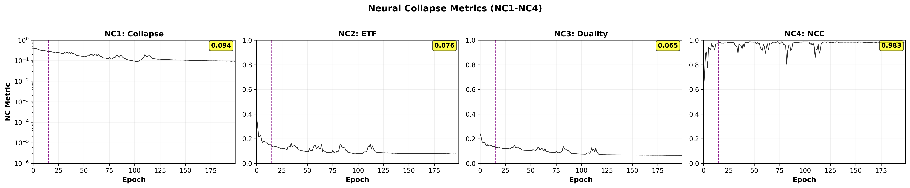
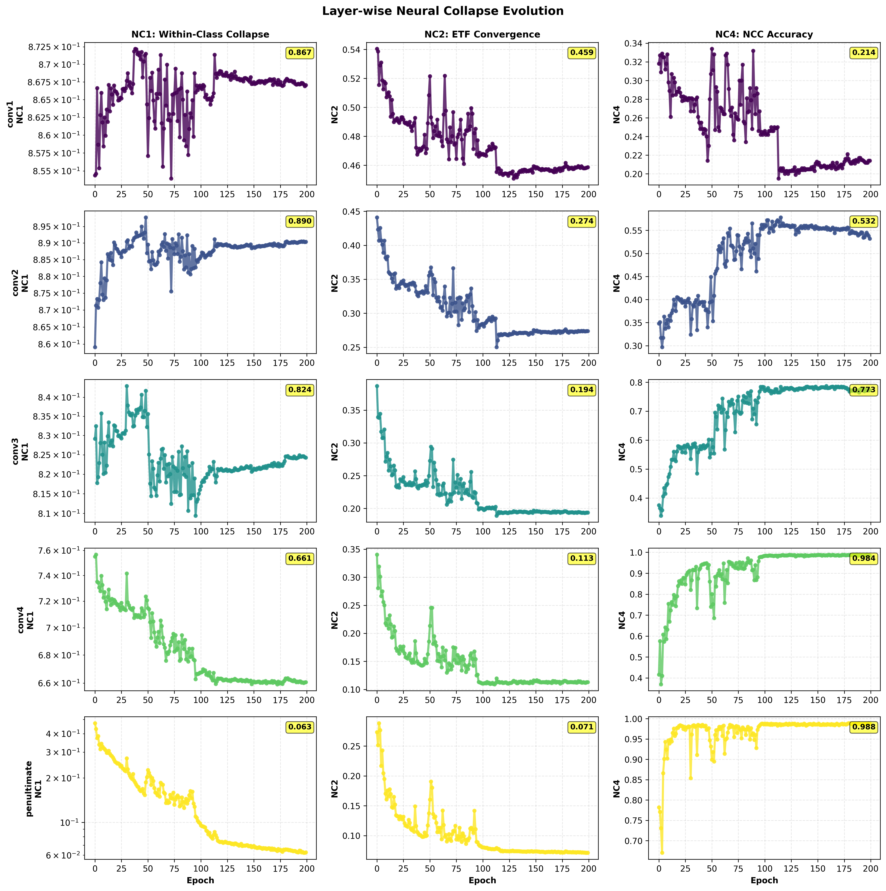
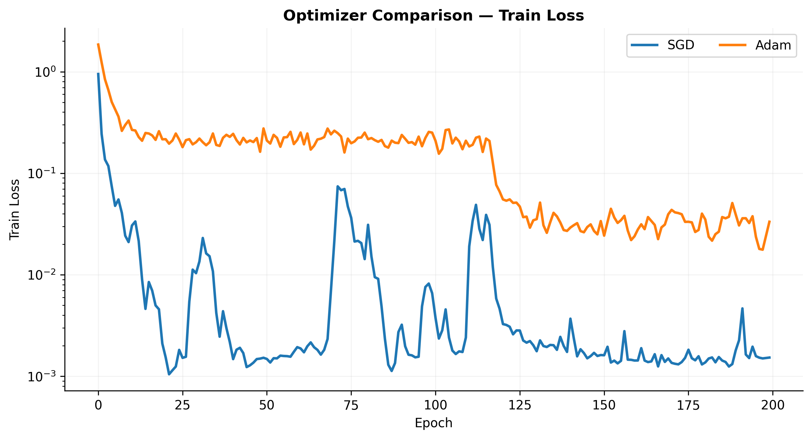
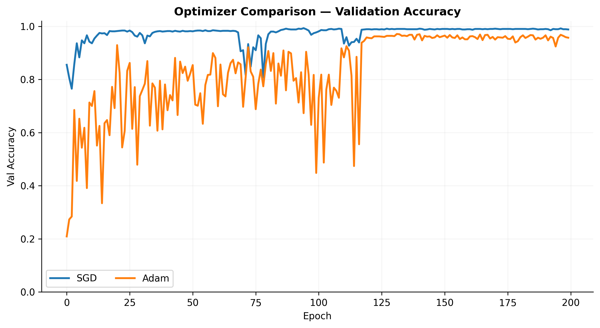
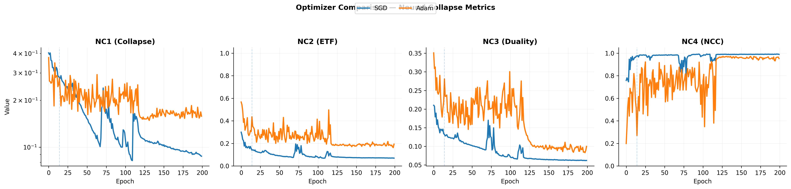

# Neural collapse in CNN-1D

Laboratory repository for the Quantitative Evaluation of Neural Networks, focused on Neural Collapse, designed to emulate the following article:
  

>Papyan, V., Han, X., & Donoho, D. L. (2020). Neural Collapse. Proceedings of the International Conference on Learning Representations (ICLR). https://arxiv.org/abs/2004.00473


The objective of this project is not merely to observe Neural Collapse but to explore its emergence through ablation studies and layer-wise analysis. 
By varying optimization methods and training regimes, we investigate which components of the learning dynamics are necessary and sufficient for the Neural Collaps regime to appear and how it progressiely forms across network layers.

This project enables controlled experiments to answer:

- *Which layers collapse first?*
- *Is ETF geometry present in early representations or only at the penultimate layer?*
- *How do different optimizers alter the collapse dynamics?*

<details> <summary>How to run the project?</summary>

Prerequisites:
```
pip install -r requirements.txt
```
Let's run Neural Collapse experiment :

```
python main_nc.py
```
> Please, always check if the configuration file it's correct
</details>
<details><summary> Project structure </summary>

<br>


```
.
├── model/
│   ├── cnn1D.py
│   │   └── CNN-1D architecture used in all experiments
│   └── cnn1D_layerwise.py
│       └── CNN-1D variant with explicit layer access for layer-wise NC analysis
├── experiments/
│   ├── run_opt_comparison.py
│   │   └── Optimizer ablation study (SGD, Adam, LBFGS)
│   ├── run_layerwise.py
│   │ └── Layer-wise Neural Collapse experiments
│   └── run_standard.py
│     └── Neural Collpase experiment
├── utils/
│   ├── data.py
│   │   └── MNIST-1D dataset loading and preprocessing
│   ├── plot_utils.py
│   │   └── All plotting utilities (training curves, NC evolution, layer-wise plots)
│   ├── model_utils.py
│   │   └── Feature extraction helpers and hooks
│   └── ProgressBar.py
│       └── Lightweight training progress visualization
├── img/
│   └── <timestamped_run>/
│       └── Saved figures for each experiment
├── main_nc.py
│   └── Entry point to reproduce all experiments
├── nc_metrics.py
└── README.md
```

</details>
<details>
<summary>Model Architecture — CNN-1D</summary>


All experiments use a fixed **CNN-1D** architecture specifically designed to expose a **high-dimensional penultimate feature space** where Neural Collapse can be measured.


```
Input (1 × 40)
   ↓
Conv1D + ReLU
(1 → 32) 
   ↓
Conv1D  + ReLU
(32 → 64)
   ↓
Conv1D  + ReLU
(64 → 128)
   ↓
Global Average Pooling
   ↓
Penultimate Layer 
(128-D feature vector)
   ↓
Linear Classifier
(128 → 10)
```
</details>


<br>


 ## 🧪 Experiment 1 — Baseline Neural Collapse with SGD

As a first experiment, we reproduce the **canonical Neural Collapse setting** described by Papyan et al. (2020) by training a **CNN-1D on MNIST-1D using standard SGD** for a sufficiently long horizon (200 epochs).
The goal of this experiment is to establish a **reference collapse trajectory** in which:
- training reaches the **interpolation regime**,
- the **Training Phase Transition (TPT)** is crossed,
- and the network converges toward the **Neural Collapse fixed point**.

During training we track the four core Neural Collapse metrics:


| Metric | Interpretation |
|--------|----------------|
| **NC1** | Within-class feature collapse |
| **NC2** | ETF structure of class means |
| **NC3** | Duality between classifier weights and class centroids |
| **NC4** | Nearest Class Center optimality |


<details> <summary>Training Dynamics </summary>
<div align="center">

</div>

The dashed vertical line marks the **TPT**, after which training accuracy saturates and the loss enters a low-noise regime.  
This phase transition is where Neural Collapse is theoretically expected to begin.
</details>
<details> <summary>Neural Collapse Metrics </summary>

<div align="center">

</div>

The four Neural Collapse conditions are measured during training:
All metrics converge after the TPT, confirming that the network enters the **Neural Collapse regime** predicted by theory.
</details>
<br>

## 🧪 Experiment 2 — Layer-wise Emergence of Neural Collapse

Neural Collapse is formally defined at the **penultimate layer**, where the cross-entropy loss directly enforces class separation and margin maximization.  
For this reason, the theory does not require earlier layers to satisfy Neural Collapse conditions.
Our layer-wise analysis reveals that:
- early convolutional layers do **not** exhibit strong within-class collapse or ETF geometry,
- intermediate layers progressively approach the Neural Collapse regime,
- the penultimate layer fully satisfies all NC conditions.

Our findings are consistent with recent empirical studies on Intermediate Neural Collapse (Rangamani et al., ICML 2023), which show that Neural Collapse emerges progressively across network depth and is fully realized only in the penultimate layer.

>Rangamani, A., Arora, S., Banburski, A., Boix-Adserà, E., Geiger, M., & Poggio, T. (2023).
Feature Learning in Deep Classifiers through Intermediate Neural Collapse.
Proceedings of the 40th International Conference on Machine Learning (ICML).
https://arxiv.org/abs/2308.02760


<details> <summary>Neural Collapse Metrics </summary>

*Layer-wise evolution of Neural Collapse metrics (NC1, NC2, NC4). Neural Collapse emerges progressively with network depth, reaching full manifestation at the penultimate layer.*

<br>
<div align="center">

</div>


</details>

<br>

## 🧪 Experiment 3 — Optimization Effects on Neural Collapse

In this experiment, we investigate how different optimization algorithms affect the emergence and stability of Neural Collapse.
While Neural Collapse is most commonly studied under standard stochastic gradient descent (SGD), recent theoretical work suggests that its geometric properties may persist across a broader class of optimization dynamics.

> Zhu, Z., Ding, T., Zhou, J., Li, X., You, C., Sulam, J., & Qu, Q. (2021).  
> *A Geometric Analysis of Neural Collapse with Unconstrained Features*.  
> International Conference on Learning Representations (ICLR).

Our empirical results **corroborate the main claims of Zhu et al. (2021)**:
- Neural Collapse consistently emerges under **SGD** and **Adam**, despite their different update rules and stochasticity,
- all core NC metrics (NC1–NC4) converge after the Training Phase Transition (TPT),
- the final feature geometry is largely optimizer-invariant for first-order methods.
<details> <summary>Training Dynamics </summary>
<div align="center">
  
  
   <p><em>Left: Train loss (log-scale) | Right: Validation accuracy across optimizers</em></p>
</div>
</details> 
<details> <summary>Neural Collapse Metrics </summary>

Figure compares the evolution of Neural Collapse metrics under SGD and Adam.
While Neural Collapse is classically studied under SGD, our results show that its geometric structure partially persists under Adam, corroborating recent theoretical findings.

<br>
<div align= "center">

</div>

</details> 


